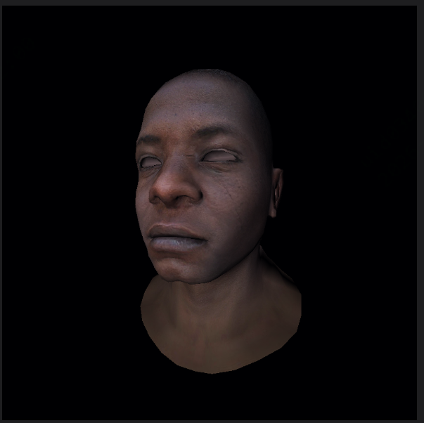

a very sample tiny renderer.

# Features
- [x] tga decode and encode
- [x] bresenham algorithm
- [x] obj model load
- [x] UV texture mapping(not perfect)
- [x] mvp transform
- [x] triangle rasterization
- [x] Perspective projection correction
- [x] a programmable rendering pipeline(not perfect)
- [x] flat shader and gouraud shader(not perfect)

# Screenshots
